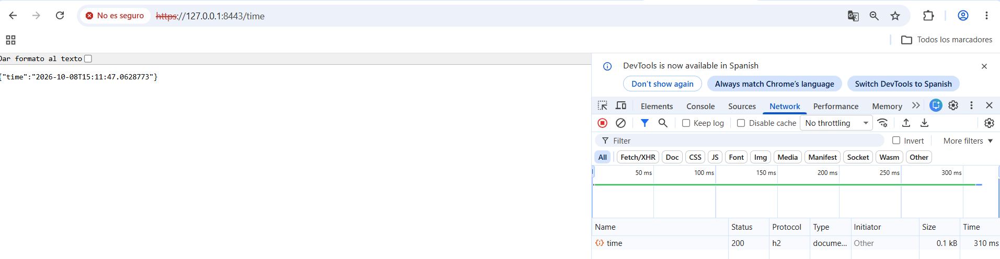

# Lab 2 Web Server -- Project Report

## What I specified

- **Custom error page.** A Thymeleaf template `error.html` under
`src/main/resources/templates` that replaces the Spring Boot whitelabel page
for HTML clients. Acceptance: `GET /missing` with `Accept: text/html` returns
`404` and a body containing the marker `Custom error page`, plus the status
code and the requested path. 

- **`/time` endpoint.** A `@RestController` backed by a `TimeProvider`
interface and a `TimeService` implementation, returning a `TimeDTO` with a
`LocalDateTime` serialised as JSON. Acceptance: `GET /time` with 
`Accept: application/json` returns `200` and a JSON body with a `time` field. 

- **HTTP/2 over TLS.** Self-signed certificate (`openssl-localhost.cnf` →
`localhost.crt` / `localhost.key` → `localhost.p12`), Spring Boot configured
on port 8443 with `server.ssl.*` and `server.http2.enabled=true`. Acceptance:
`curl -v --http2 -k` reports `ALPN: server accepted h2` and `HTTP/2` in the
status line for both `/` and `/time`

## What I changed

- Added `src/main/kotlin/es/unizar/webeng/lab2/TimeComponent.kt` with
  `TimeDTO`, `TimeProvider`, `TimeService`, the `LocalDateTime.toDTO()`
  extension and `TimeController` exposing `GET /time`.
- Added `src/main/resources/templates/error.html`, a Thymeleaf template that
  reads `${status}` and `${path}`.
- Added `src/main/resources/application.yml` enabling TLS on port 8443 with
  the PKCS12 keystore `classpath:localhost.p12` and HTTP/2.
- Added `src/test/resources/application.yml` disabling SSL so the tests keep
  running on plain HTTP on a random port.
- Added `src/test/kotlin/es/unizar/webeng/lab2/ErrorPageTest.kt`
  (`TestRestTemplate`, real server, random port) and
  `src/test/kotlin/es/unizar/webeng/lab2/TimeControllerTest.kt`.
- Added `src/main/resources/localhost.p12`.
- No production code beyond the above; `Application.kt` and
  `ApplicationTests.kt` are unchanged.

## Technical decisions

- **Followed the guide's steps closely.** I implemented the three tasks in the
  order the guide proposes (error page → `/time` → TLS), using the same class
  names, package and file locations it suggests. Rejected: inventing my own
  structure this time
- **Kept everything as simple as possible.** Minimal DTO (`TimeDTO` with a
  single `LocalDateTime`), minimal error page (only `${status}` and `${path}`),
  and no extra configuration. The idea was that if something broke,
  the source of the error would be easy to isolate.
- **Implemented only the step-further of task 1.** Showing `status` and `path`
  on the error page is a two-line change in the Thymeleaf template plus two
  assertions in `ErrorPageTest`. I rejected the step-furthers of tasks 2 and 3.
- **No bonus.** I did not propose an extra during the lab window.

## How I verified
With:
```bash
./gradlew ktlintFormat
./gradlew ktlintCheck
./gradlew check
```
Manual check on Git Bash
```bash
./gradlew bootRun
```
Manual check on WSL:
```bash
curl -v --http2 -k -H "Accept: text/html" -i https://172.22.144.1:8443/

*   Trying 172.22.144.1:8443...
* ALPN: curl offers h2,http/1.1
...
* ALPN: server accepted h2
...
< HTTP/2 404
HTTP/2 404

<!DOCTYPE html>
<html lang="en">
<head>
    <meta charset="UTF-8">
    <title>Custom error page</title>
</head>
<body>
<h1>Error OnO</h1>
<p>Status: <span>404</span></p>
<p>Path: <span>/</span></p>
</body>
```

```bash
curl -v --http2 -k -i https://172.22.144.1:8443/time

*   Trying 172.22.144.1:8443...
* ALPN: curl offers h2,http/1.1
...
* ALPN: server accepted h2
...
{"time":"2026-10-08T23:15:56.4933095"}
```

Also, on the browser check on https://127.0.0.1:8443/time. 
DevTools → Network shows Status 200, 
Protocol h2, body {"time":"2026-10-08T15:11:47.0628773"}.
This proves TLS + HTTP/2 + JSON in one shot.



What failed first: `./gradlew check` errored because the test `application.yml`
was in the wrong folder. The file existed but was located at
`src/test/kotlin/resources/` instead of `src/test/resources/`, so Spring never
loaded it. `TestRestTemplate` has no trust store for the self-signed
`localhost.p12`, so the handshake failed and the tests errored before running
any assertion. Moving the file to `src/test/resources/application.yml` made the
override apply (`server.ssl.enabled: false`) and the tests passed.

## AI disclosure

- **Tools / skills:** Deepseek used as an assistive tool.
- **Purpose:** Debugging
- **Representative prompts:** "Porq peta al hacer ./gradlew check si he seguido todos los pasos de la guia al pie de la letra?"
- **Affected files/sections:** src/test/kotlin/resources/application.yml --> src/test/resources/application.yml
- **Validation steps:** Moved the test `application.yml` from the wrong folder to `src/test/resources/application.yml`, then re-ran `./gradlew check` and the two `curl` checks in the guide; all pass.
- **Citations:** No external code snippets were copied
- **Human-reviewed:** I applied the fix and re-ran the tests

